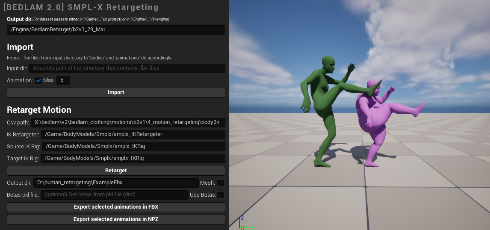
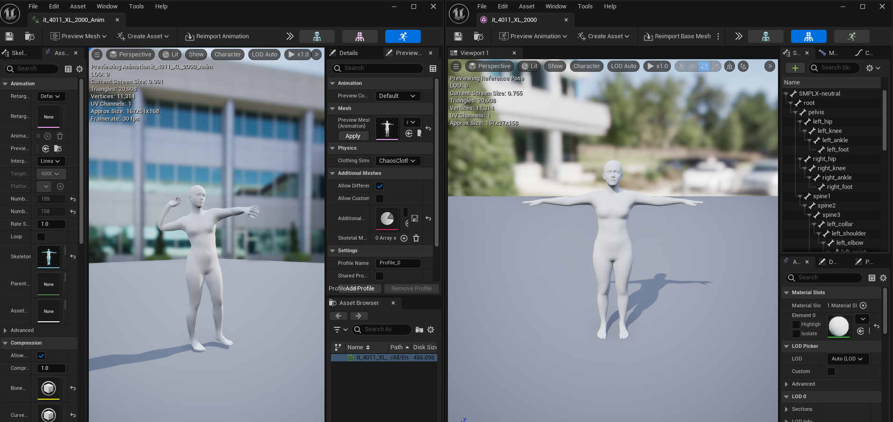
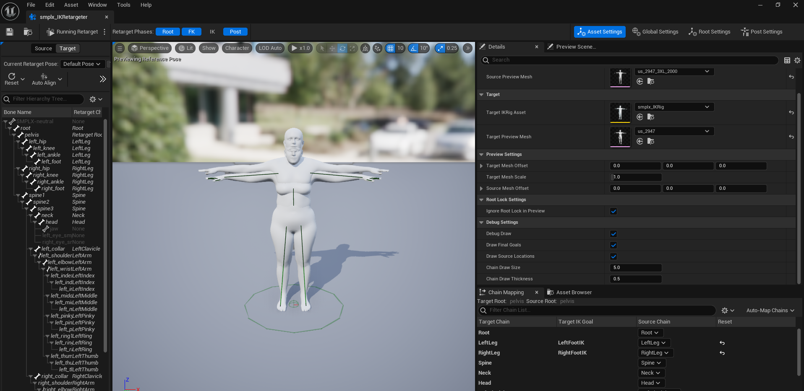
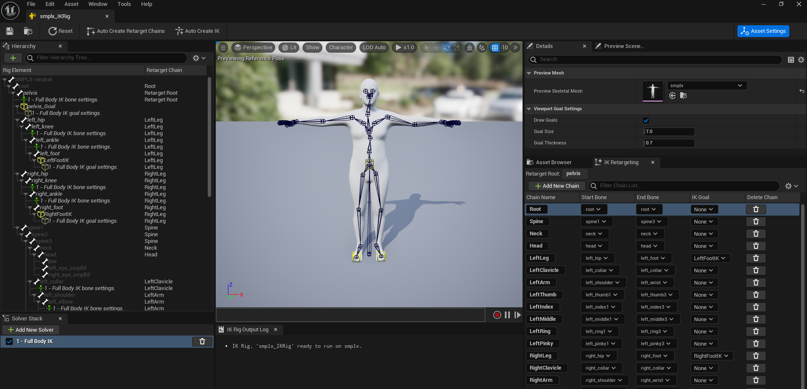
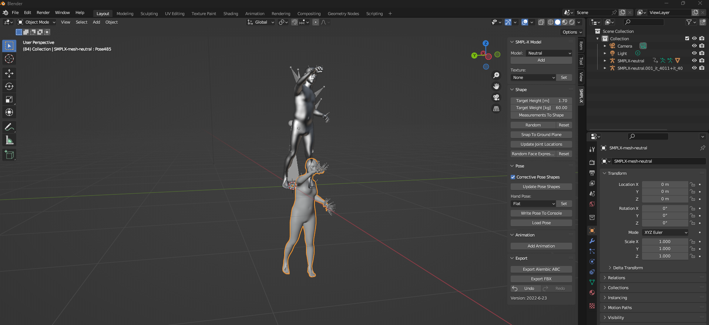

# Retargeting for BEDLAM 2.0

Retargeting transfers motion from one skeleton to another, enabling the augmentation of SMPL-X data with various body shapes while preserving motion quality.

This repository contains the retargeting tool developed for [BEDLAM 2.0 NeurIPS 2025](https://bedlam2.is.tuebingen.mpg.de/), built on [Unreal Engine's IK Retargeter](https://dev.epicgames.com/documentation/en-us/unreal-engine/ik-rig-animation-retargeting-in-unreal-engine?application_version=5.3) by Epic Games.

We provide two branches: `5.3` and `5.4`. Switch to the desired branch based on your Unreal Engine version.

For the latest UE retargeting features, visit the [Unreal Engine documentation](https://dev.epicgames.com/documentation/en-us/unreal-engine/ik-rig-animation-retargeting-in-unreal-engine).

### Requirements:
- Unreal Engine 5.3 or 5.4 _(please switch to the desired branch)_
- Enable Python plugin
- Enable Python Foundation Packages Plugin (numpy) (optional for loading .npz files)
- Enable Python Remote Execution

### Instructions:

1. Open the project in Unreal Engine.
2. Run the widget in the Unreal Engine Editor by Right-Clicking on the `Widgets/HumanEngineWidget` and selecting `Run Editor Utility Widget`.
3. Import `.fbx` files: animations (sources) and bodies (targets), either using the widget or with `import_batch.py`.
4. Retarget animations based on the `.csv file` pairs configuration, either using the widget or with `retarget_batch.py`.
5. Export the retargeted animations in `.fbx` files and/or `.npz (SMPL-X)` files.

_Find details below!_


### Dataset preparation (FBX files and CSV file)

1. Prepare 2 directories:
    - `animations` directory with `.fbx` files (source animations).
    - `bodies` directory with `.fbx` files (target body).
2. Prepare the `csv` file with the pairs configuration.
    - Example:
    - `target_body,source_anim\n`
    - `<target_body_a>,<source_animation_x>\n`.

### For faster importing

For faster importing of the `.fbx` files, use `import_batch.py` script.

Use `--animation` flag to import the animations.

```bash
cd retargeting\Content\Python
# Example of --num_batches 10 --processes 5: Splits the data into 10 batches. It will spawn 5 Unreal Engine at the same time to process the batches.
# (use UE paths: either \Game or \Engine) --output_dir: \Engine\BedlamRetarget\b2_testing_tool
python .\import_batch.py --input_dir <input_dir_of_fbx_files> --output_dir <output_abs_dir_of_uassets> --num_batches 10 --processes 5
```

Or use the GUI, by clicking on `Import` button and setting the Animation toggle button, to import either bodies or animation from an `absolute path directory`.

### Make sure all animations and all skeletons are on the floor!

Please use the latest `SMPL-X` Blender Plugin to load `.npz` and export the `.fbx` files (there's an option to
load/export them on the floor).



### Keep IK disabled in the IK-Retargeter



### Use a SMPL-X IK Rig

We provide an example `SMPL-X IK Rig` (credits: **Joachim Tesch**).

You may use your own IK Rig as well. If the source and target skeletons have different chain names, they must be mapped in the IK Retargeter.



### Pipeline

1. Define the `output_dir` (`/Engine/...` or `/Game/...`).
2. Import the `.fbx` files from the `input_dir`.
3. Check `Animation` (boolean) to import the animation as well -> saves in `{output_dir}/animations/`.
4. Uncheck `Animation` (boolean) to import the skeleton only -> saves in `{output_dir}/bodies/`.
5. Define the `csv_file` using the names. Example: `target_body_a source_animation_x\n`.
6. Click `Retarget` to retarget the animations -> saves in `{output_dir}/retargeting/`.
7. Click `Export` to export the retargeted animations in `.fbx` files (with or without mesh) or `.npz` (SMPL-X without
   betas).


### Retargeting with multiple processes (recommended)

Use the `retarget_batch.py` script to retarget animations with multiple processes in batches.

```bash
 python .\retarget_batch.py \
 --pool_dir /Engine/BedlamRetarget/b2v3 \
 --csv_path_retargeting D:\\UE_5.4\\Engine\\Content\\BedlamRetarget\\b2v3\\4_motion_retargeting\\body2motion.csv \
 --num_batches 100 \
 --processes 10
```

### Exporting (with/without betas but without bind_pose_height_offset)

We can export the retargeted animations in `.fbx` files (with or without mesh) and/or `.npz` (SMPL-X params).

For **simplicity**, we work only with `.fbx` files.

To include the `betas` or `bind_pose_height_offset` we need to **load them back from the original ones**.

**Optional feature:** Get the betas from `.pkl` file (dictionary with **key** as `target_name` and **value** as `betas`).
See the widget for more info. 
Do **NOT** use pandas to export the .pkl file as UE does not support it.


#### Code snippet from `export_npz.py`:

```python
# Code from Joachim Tesch

# But for simplicity, we don't load the betas or the bind_pose_height_offset
for joint_name in SMPLX_JOINT_NAMES:

    if joint_name == "pelvis":
        pose = anim_pose.get_relative_to_ref_pose_transform(joint_name, space=unreal.AnimPoseSpaces.WORLD)

        translation = pose.translation
        t_x = translation.x / 100
        t_y = -translation.y / 100  # Unreal SMPL-X bind pose Y-axis faces down
        t_z = translation.z / 100
        # (We ignore the bind_pose_height_offset, as we work only with .fbx files)
        trans.append([t_x, t_y, t_z])
    else:
        pose = anim_pose.get_relative_to_ref_pose_transform(joint_name, space=unreal.AnimPoseSpaces.LOCAL)

    rotation = pose.rotation
    rotation_axis = rotation.get_rotation_axis()
    rotation_angle = -rotation.get_angle()

    rod_x = rotation_axis.x * rotation_angle
    rod_y = -rotation_axis.y * rotation_angle  # Unreal SMPL-X bind pose Y-axis faces down
    rod_z = rotation_axis.z * rotation_angle
```

#### Contents of exported `.npz` files:

| key              | description                          |
|------------------|--------------------------------------|
| gender           | neutral                              |
| mocap_frame_rate | 30.0                                 |
| model            | smplx_locked_head                    |
| betas            | np.zeros(10) or loaded from pkl file |
| poses            | (frames, 165)                        |
| trans            | (frames, 3)                          |
| info             | Exported from UE version xx          |

**Visualization in Blender:**

We can visualize the files in Blender using the `SMPL-X` Blender Plugin for the `.npz`.
- `.fbx`: Metalic one, on the floor.
- `.npz (with or without betas)`: No texture, below the floor (as the `bind_pose_height_offset` is ignored).



### bind_pose_height_offset (NOT handled here)

bind_pose_height_offset is **NOT** handled by this tool.

For simplicity, in this tool we work only with `.fbx` files.

Otherwise, we would need the `.npz` files that contain the `betas` and the `bind_pose_height_offset`.

```python
updated_transl = [ t_x, t_y + bind_pose_height_offset, t_z]
```

### Next step of the pipeline

*(After using this retargeting tool)*

- We get the `betas` and `pose height offset` (from the original `.npz` files - as exported from Blender Plugin >=2024-Apr-05)
- We re-compute the `pose height offset` that **brings the character to the correct height** (snapped on the floor) and we
  change the `transl` accordingly (we don't use the `bind_pose_height_offset`).
- Then, we continue with the `Clothing Simulation Pipeline`.
